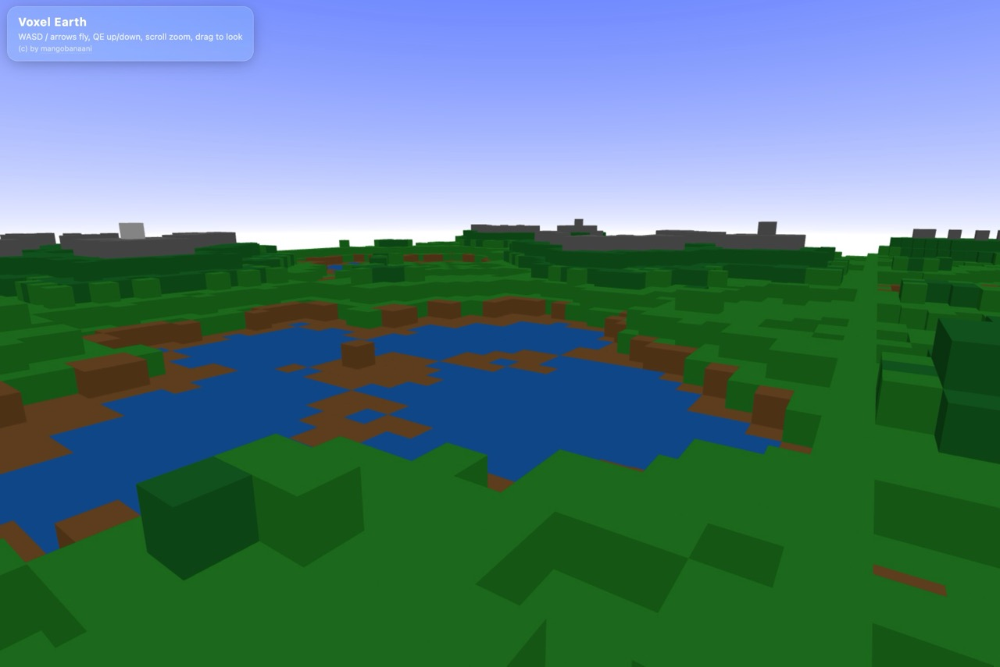

# VoxelEarth

A simple procedural voxel world built with **Next.js** and **Three.js**. Explore terrain with Minecraft-style voxels, featuring 8 distinct biomes from deep ocean trenches to snowy mountain peaks.

VoxelEarth uses multi-layered mathematical noise functions to generate realistic terrain in real-time. 

## Screenshots


*Expansive voxel terrain with procedural biomes and gradient sky*

## Features

- **Procedural Terrain Generation**: Multi-layered noise functions create realistic landscapes
- **5-Layer Noise System**: Continental features down to fine detail variation
- **8 Biome System**: Snow, rock, forest, grass, dirt, sand, water, and deep water biomes
- **Water Level System**: Realistic lakes and water bodies with proper depth rendering
- **First-Person Controls**: Smooth WASD movement with mouse look and pointer lock
- **Beautiful Sky**: Gradient shader system with blue-to-white sky dome
- **Performance Optimized**: InstancedMesh rendering handles 16,000+ voxels smoothly
- **Glass UI**: Clean, modern interface with frosted glass panels

## Controls

- **WASD**: Move forward/backward and strafe left/right
- **Q/E**: Move down/up vertically
- **Mouse**: Look around (click to lock cursor)
- **Space/Shift**: Alternative up/down movement

## Getting Started

```bash
# Install dependencies
npm install

# Start development server
npm run dev
```

Then open [http://localhost:3000](http://localhost:3000) to explore your voxel world

## Technical Details

- **Framework**: Next.js 14.2.5 with TypeScript
- **3D Engine**: Three.js with WebGL rendering
- **Terrain**: 128x128 grid generating 16,000+ voxel instances
- **Materials**: Separate InstancedMesh for each biome type
- **Generation**: 5-layer mathematical noise (continental to fine detail)
- **Collision**: Ground collision system prevents falling through terrain

## Testing

Run the test suite:

```bash
npm test
```

## License

This project is licensed under the GNU General Public License v3.0 (GPL-3.0).

You are free to use, modify, and distribute this software under the terms of the GPL. For more details, see the [GNU General Public License](https://www.gnu.org/licenses/gpl-3.0.en.html).

---

**Copyright (c) 2025 mangobanaani**

*VoxelEarth - Created with passion for voxel worlds and procedural generation*

